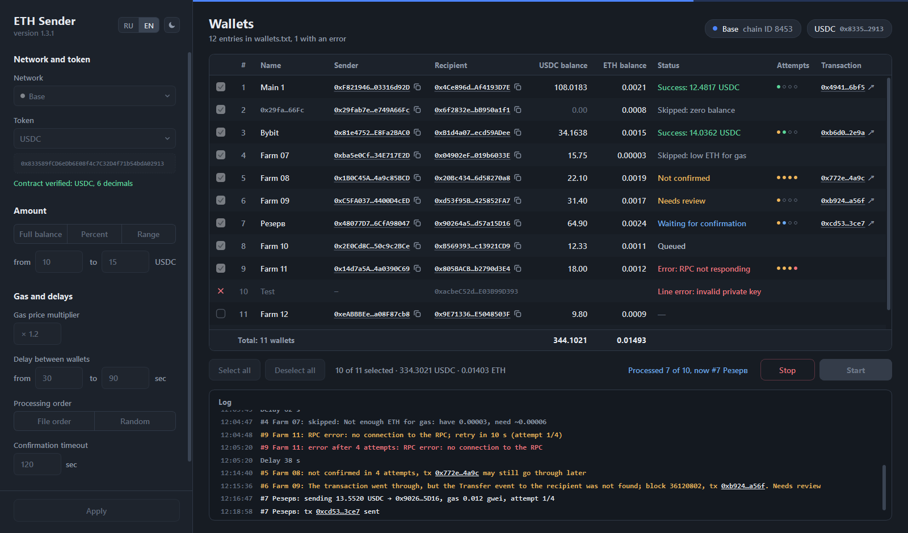
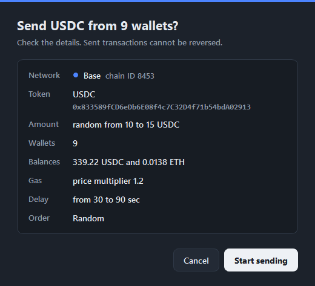
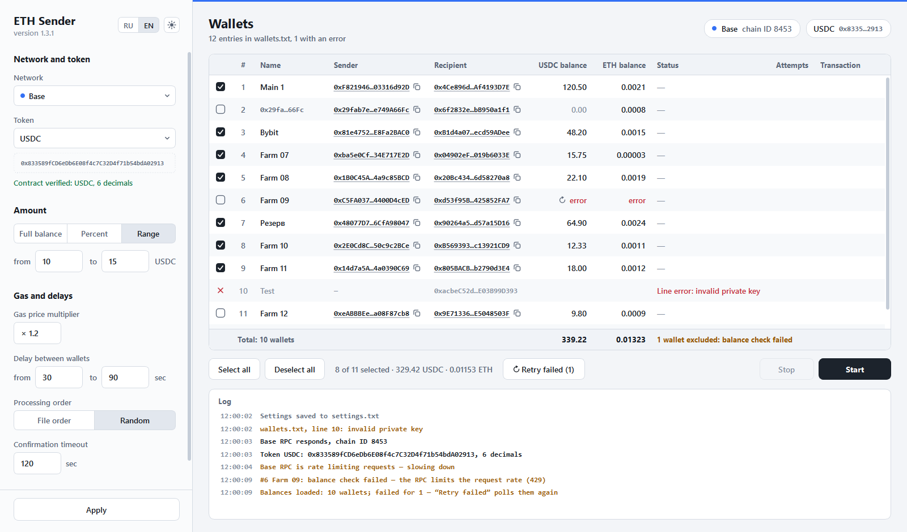

# ETH Sender

[Русская версия](README.ru.md)

Small Windows GUI tool for sending ETH (or BNB, AVAX) and ERC-20 tokens from a batch of wallets in one go. Every wallet has its own recipient address, so it's handy for things like moving funds from many wallets to exchange deposit addresses.



Networks: Ethereum, Arbitrum, Optimism, Base, BSC, Avalanche, Robinhood Chain.

## What it does

- sends the native coin, USDT/USDC (including USDT0, USDC.e, USDbC and other variants, plus USDG on Robinhood) or any ERC-20 by contract address
- amount per wallet: full balance, a percent of the balance, or a random amount from a range
- random delay between wallets, file order or random order, Stop button
- waits for the receipt of every transaction, and for tokens also looks for the Transfer event, before a wallet is marked as done
- up to 3 retries on errors. A stuck transaction is replaced using the same nonce, so the same transfer can't go out twice
- shows token and native coin balances of all wallets before you start
- English and Russian interface, dark and light theme

One run is one network and one token.

## Download

Get the zip from [Releases](https://github.com/vv-bobody/ETH_Sender/releases/latest), unpack it anywhere and run `ETH_Sender.exe`. Python is not needed.

The exe is not code-signed, so SmartScreen will complain on the first launch (More info, then Run anyway). Some antiviruses don't like PyInstaller builds in general. The SHA-256 of the archive is on the release page, check it with:

```
certutil -hashfile ETH_Sender-1.3.1-win64.zip SHA256
```

If you'd rather not run someone else's exe on a machine with your keys, build it yourself, see below.

## Usage

On the first start the program creates `settings.txt` and `wallets.txt` next to the exe.

Put the wallets into `wallets.txt`, one per line:

```
# name,private key,recipient address
Main 1,0x<private key>,0x1111111111111111111111111111111111111111
# the name can be left out
0x<private key>,0x2222222222222222222222222222222222222222
```

Then in the window:

1. Pick the network, token, amount and delays and press Apply. The settings get saved, the RPC is checked and the balances are loaded.
2. Tick the wallets you want to send from.
3. Press Start and confirm.



Each wallet gets a status, an attempt counter and a link to its transaction in the table. Details go to the log at the bottom.

Some notes:

- The default RPCs are public ones and they rate-limit a lot. If some balances fail to load, press ↻ in that row or "Retry failed". The program also slows down by itself when it starts getting 429s. You can set your own RPC URLs in the settings panel.
- With the old bridged tokens (USDC.e, USDbC, USDT.e) the confirmation window shows a warning, because exchanges usually credit only native USDC and USDT.
- Clicking an address opens it on DeBank, clicking a transaction hash opens the block explorer.
- The language and theme switches are at the top of the settings panel.
- To update, unpack the new version and copy your `settings.txt` and `wallets.txt` into it.



## About keys

`wallets.txt` is a plain text file with private keys and nothing in it is encrypted, so keep the folder somewhere safe. The keys are only used locally to sign transactions. The program talks to the RPC endpoints from the settings and to nothing else, and it checks the chain ID before sending.

Transactions can't be undone. Try a small amount first.

## Building from source

You need Windows 10/11 and Python 3.13.

```
build.bat
```

This makes `dist\ETH_Sender\ETH_Sender.exe` and a desktop shortcut. The build uses its own venv (`.venv-build`) and installs dependencies only from `requirements.lock`, with hash checking and wheels only. `settings.txt` and `wallets.txt` in `dist\ETH_Sender` survive a rebuild, anything else in that folder does not.

To bump dependencies: update them in `.venv`, test, then run `tools\make_lock.py`. It regenerates the lock files and refuses to do it if OSV lists vulnerabilities for the new versions.

## Development

```
python -m venv .venv
.venv\Scripts\python -m pip install -r requirements.txt pytest
.venv\Scripts\python main.py
.venv\Scripts\python main.py --demo
.venv\Scripts\python -m pytest
```

`--demo` opens the window with fake data and no network access, which is handy for UI work (the screenshots here were made this way). `tools\check_networks.py` does a read-only check of the default RPCs, `tools\render_ui.py` renders UI snapshots into `design/`.

The tests in `tests/test_local_chain.py` need `eth-tester` and `py-evm==0.12.1b1` and are skipped without them.

UI strings are in English in the code, the Russian translation is in `app/ru.py`. `tests/test_i18n.py` fails if a string has no translation.

Comments like "spec 5.6" in the code point to my own spec for the project. It is not in the repo.

Built with Python, PySide6 (Qt 6), web3.py and PyInstaller.

## License

[MIT](LICENSE)
