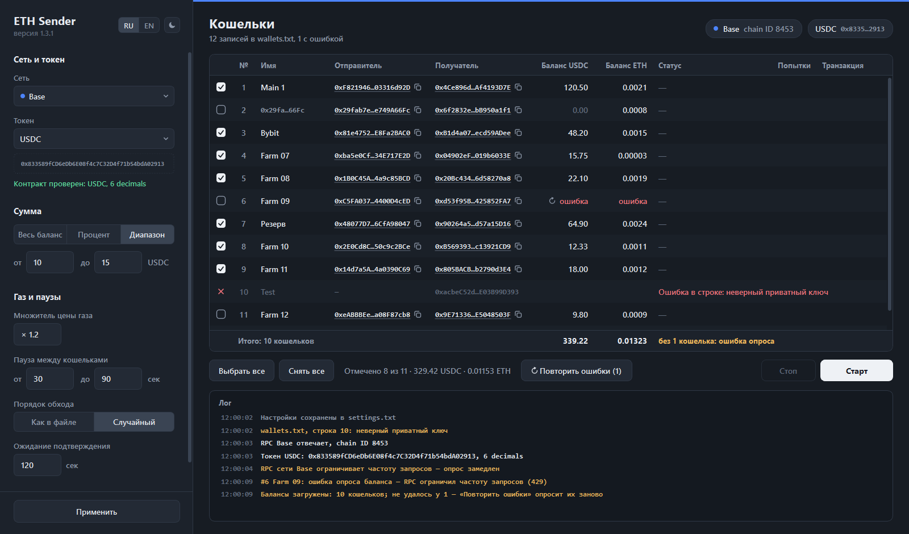
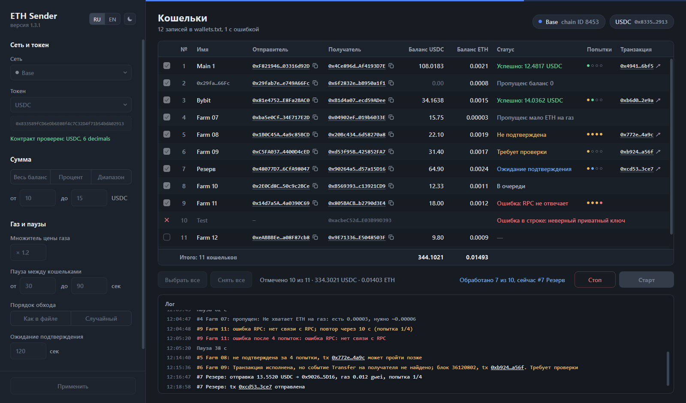
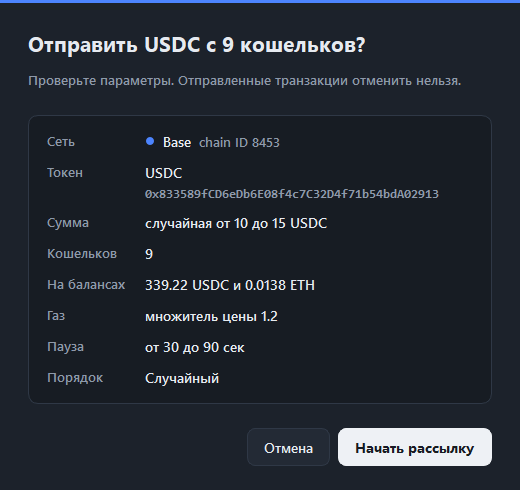
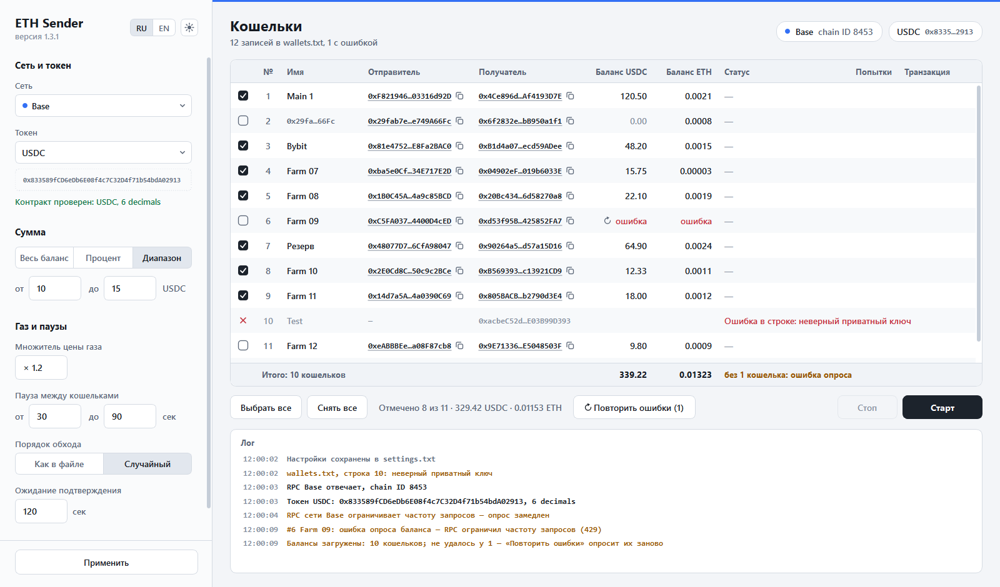

# ETH Sender

[English version](README.md)

Программа для Windows с графическим интерфейсом: пересылает нативную монету (ETH, BNB, AVAX) или токен ERC-20 с набора кошельков на заданные адреса. Поддерживаемые сети: Ethereum, Arbitrum, Robinhood Chain, Optimism, BSC, Base и Avalanche.

- За один запуск — одна сеть и один токен; у каждого кошелька свой получатель.
- Сумма — весь баланс, процент от него или случайная сумма из диапазона.
- Каждая транзакция проверяется на исполнение. При неудаче — до 3 повторов; зависшая транзакция заменяется с тем же nonce, поэтому двойного перевода не будет.
- Порядок как в файле или случайный, случайные паузы между кошельками, кнопка «Стоп».
- Интерфейс на английском и русском, тёмная и светлая темы.

## Как это выглядит

На снимках — программа с демо-данными (`main.py --demo`).

Кошельки и балансы загружены, нужные кошельки отмечены галочками:



Идёт рассылка — статусы, попытки, ссылки на транзакции и лог:



Окно подтверждения перед стартом:



Светлая тема:



## Требования

- Windows 10 или 11, x64.
- Python 3.13 — только для сборки программы или запуска из исходников. Готовому `ETH_Sender.exe` Python не нужен.

## Скачать

Скачайте `ETH_Sender-<версия>-win64.zip` со страницы [Releases](https://github.com/vv-bobody/ETH_Sender/releases/latest), распакуйте в любую папку и запустите `ETH_Sender.exe`.

- Файл не подписан сертификатом, поэтому Windows SmartScreen может показать «Система Windows защитила ваш компьютер»: нажмите **Подробнее → Выполнить в любом случае**. Некоторые антивирусы ругаются на любые программы, собранные PyInstaller.
- На странице выпуска указан SHA-256 архива. Проверьте его перед распаковкой: `certutil -hashfile ETH_Sender-<версия>-win64.zip SHA256`.
- Чтобы обновиться, распакуйте новую версию и скопируйте в её папку свои `settings.txt` и `wallets.txt`.

Программа работает с приватными ключами, поэтому вы можете не захотеть запускать готовый файл. Тогда соберите её сами: запустите `build.bat` — он соберёт `dist\ETH_Sender\ETH_Sender.exe` и создаст ярлык «ETH Sender» на рабочем столе. Подробности — в разделе [Сборка](#сборка), запуск из исходников — в разделе [Для разработки](#для-разработки).

## Как пользоваться

1. Запустите `ETH_Sender.exe` (или ярлык «ETH Sender» на рабочем столе, если собирали программу сами). При первом запуске рядом с программой появятся `settings.txt` и `wallets.txt`.
2. Впишите кошельки в `wallets.txt`, по одному в строке: `имя,приватный ключ,адрес получателя` или без имени — `приватный ключ,адрес получателя`. Форматы можно смешивать.
3. В окне выберите сеть, токен, сумму и паузы, затем нажмите «Применить»: программа сохранит настройки, проверит RPC и загрузит балансы. В списке «Токен» — нативная монета, готовые стейблкоины сети (USDT, USDC и их варианты вроде USDT0 или мостового USDC.e, в Robinhood — USDG) и «Другой ERC-20» по адресу контракта.
4. Отметьте галочками кошельки, нажмите «Старт» и подтвердите. Если выбран старый мостовой токен (USDC.e, USDbC, USDT.e), окно подтверждения предупредит: биржи часто зачисляют только родные USDC и USDT.

Интерфейс по умолчанию на английском. Переключатель «RU | EN» вверху панели настроек включает русский, значок рядом — светлую или тёмную тему. Выбор сразу сохраняется в `settings.txt` и не требует «Применить».

Под таблицей строка «Итого» складывает балансы токена и нативной монеты всех кошельков, а рядом со счётчиком «Отмечено N из M» — суммы отмеченных. Если у части кошельков баланс не загрузился (публичные RPC часто ограничивают частоту запросов), нажмите ↻ рядом со словом «ошибка» или «Повторить ошибки» — заново опросятся только эти кошельки. При ограничении частоты программа сама замедляет опрос.

Для каждой сети уже задан публичный адрес RPC. Его можно заменить в панели настроек, например на адрес своего узла или провайдера.

## Безопасность

- Приватные ключи используются только для подписи транзакций на вашем компьютере. Они не показываются в окне, не пишутся в лог и никуда не передаются: в сеть уходят только подписанные транзакции.
- Программа обращается только к адресам RPC из настроек. Ссылки на эксплорер и DeBank открываются в браузере только по вашему клику.
- Перед отправкой проверяется chain ID, поэтому неверный адрес RPC не отправит транзакцию в другую сеть.
- `wallets.txt` хранит приватные ключи в открытом виде — держите папку программы в надёжном месте. В `settings.txt` могут быть адреса RPC с API-ключами. Оба файла перечислены в `.gitignore`; не добавляйте их в коммиты.

Отправленные транзакции отменить нельзя. Сначала попробуйте на небольшой сумме. Программа предоставляется как есть, без каких-либо гарантий — см. раздел [Лицензия](#лицензия).

## Сборка

`build.bat` собирает `dist\ETH_Sender\ETH_Sender.exe` и создаёт ярлык на рабочем столе. Сборка идёт в отдельном чистом окружении `.venv-build`, пакеты ставятся строго по `requirements.lock`: точные версии, хеши SHA-256, только готовые wheel, без сборки из исходников. Если хоть один файл отличается от зафиксированного, сборка останавливается. `settings.txt` и `wallets.txt` в `dist\ETH_Sender` при пересборке сохраняются, другие файлы в этой папке — нет: PyInstaller создаёт её заново.

Обновлять версии пакетов стоит осознанно: обновить их в `.venv`, проверить, затем выполнить `.venv\Scripts\python tools\make_lock.py`. Скрипт перепишет `requirements.lock` и `requirements-pip.lock` и откажется это делать, если в базе OSV есть уязвимости или записи о вредоносности для этих версий.

## Для разработки

```
python -m venv .venv
.venv\Scripts\python -m pip install -r requirements.txt pytest
.venv\Scripts\python main.py            # программа из исходников
.venv\Scripts\python main.py --demo     # окно с демо-данными, без сети
.venv\Scripts\python -m pytest          # тесты
.venv\Scripts\python tools\check_networks.py   # проверка RPC всех сетей, только чтение
.venv\Scripts\python tools\render_ui.py        # снимки интерфейса в обеих темах, в папку design/
```

Тесты на локальном блокчейне (`tests/test_local_chain.py`) запускаются, если установлены `eth-tester` и `py-evm==0.12.1b1`; без них пропускаются. Эти пакеты нужны только для тестов и в сборку не попадают.

Тексты интерфейса в коде написаны по-английски, русский перевод — `app/ru.py`. `tests/test_i18n.py` проверяет, что у каждого текста есть перевод с теми же подстановками.

В комментариях в коде встречаются ссылки вида «spec 5.6». Это номера пунктов внутренней спецификации проекта, в репозиторий она не входит.

## Лицензия

[MIT](LICENSE)
